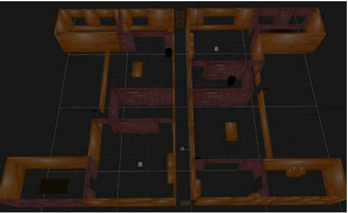
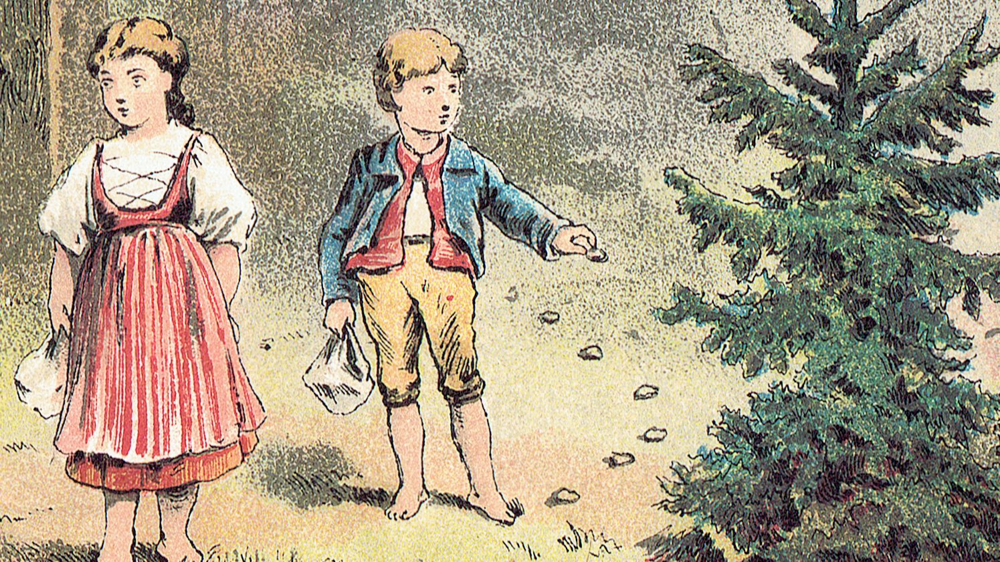
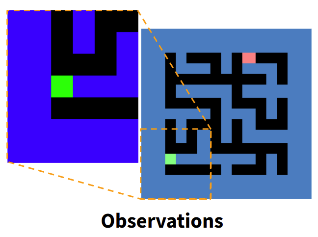
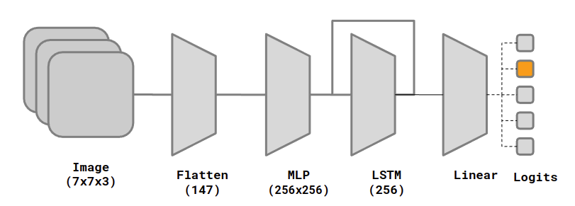
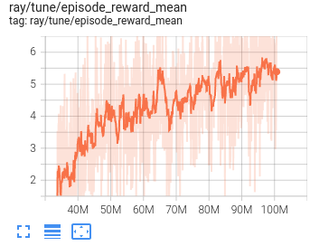
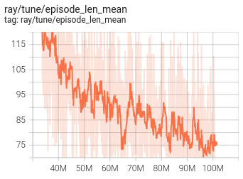
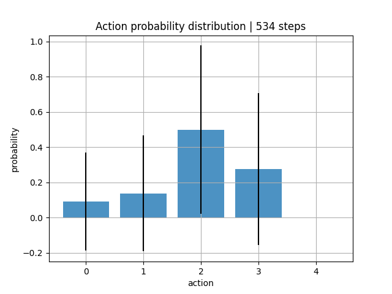
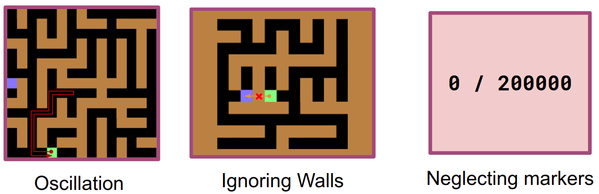

# AI617 Project: Active Maze Traversal

## Yoonyoung Cho | KAIST SP2022

## Maze Traversal

* Robot Localization and navigation in highly symmetrical environments is a challenging problem[^1].
* Under partial and noisy observations with limited memory, localition of the current pose cannot be easily disambiguated.

## Key Idea: Embodied, Active Localization

* In the fable _Hansel and Gretel_, the lost siblings place trails of breadcrumbs
in a self-similar forest to guide their navigation.
* Taking inspiration from this, we seek an embodied agent that can actively break
symmetries in the environment, to facilitate repeated and reliable localization.

## Environment Setup

In order to test our agent, we first develop an active localization environment,
a wrapper around [`procgen-maze-v0`](https://github.com/openai/procgen) environment.
By testing a maze-traversal task, we can validate the agent's ability to navigate on the basis
of accurate localization information.

We extend the base environment with the ability to place markers, as follows:

The observations provided to the agent are egocentric 7x7 crops, seen as follows:

The full environment action-space and the reward model is provided below:

### Action Space

| Index  | 0         | 1         | 2       | 3          | 4            |
|--------|-----------|-----------|---------|------------|--------------|
| Action | Move Left | Move Down | Move Up | Move Right | Place Marker |

### Reward Scheme

| Condition | Move{L,D,U,R} | Place Marker | Reach Goal |
|-----------|---------------|--------------|------------|
| Reward    | -0.1          | -1           | +10        |

## Model Architecture

To solve this long-horizon task, we implement a simple baseline agent with PPO-LSTM  architecture, shown above.
In particular, we use the following hyperparameters:

| Field | steps | gamma | batch_size | learning rate | ppo_clip | grad_clip | gae_lmda |
|:-----:|:-----:|:-----:|:----------:|:-------------:|:--------:|:---------:|:--------:|
| Value | 100M  | 0.998 |    2048    |      5e-5     |    0.1   |    1.0    |    0.8   |

## Experimental Results

Summary of the agent's training progression over 100M training steps is shown below:

| |  |
|-----------|---------------|
| Reward.   | Episode Length.|

accordingly, we find that the agent learns to traverse the maze more quickly over time.

Video demonstration of our agent:

However, action distribution shows that the agent never places the markers:

### Remaining Issues

## References
[^1]: Cobbe, Karl, Christopher Hesse, Jacob Hilton and John Schulman. “Leveraging Procedural Generation to Benchmark Reinforcement Learning.” ArXiv, 2020
[^2]: S. K. Gottipati, K. Seo, D. Bhatt, V. Mai, K. Murthy and L. Paull, "Deep Active Localization," in IEEE Robotics and Automation Letters, 2019

