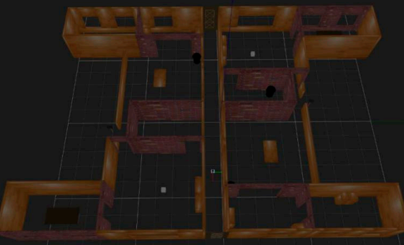
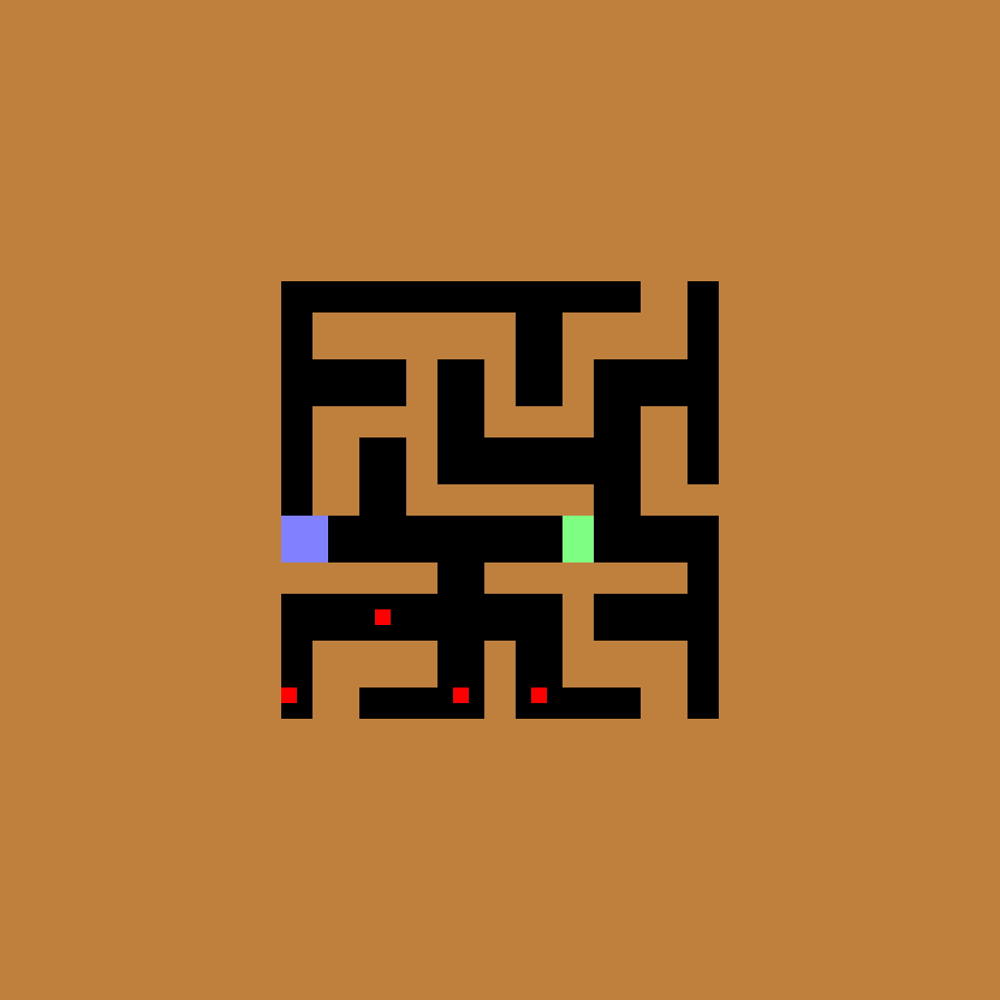

# AI617 Project: Active Maze Traversal

## Yoonyoung Cho | KAIST SP2022

## Maze Traversal

* Robot Localization and navigation in highly symmetrical environments is a challenging problem[^1],[^2].
* Under partial and noisy observations with limited memory, localition of the current pose cannot be easily disambiguated.

## Key Idea: Embodied, Active Localization

* In the fable _Hansel and Gretel_, the lost siblings place trails of breadcrumbs
in a self-similar forest to guide their navigation.
* Taking inspiration from this, we seek an embodied agent that can actively break
symmetries in the environment, to facilitate repeated and reliable localization.

## Environment Setup

In order to test our agent, we first develop an active localization environment,
a vectorized wrapper around [`procgen-maze-v0`](https://github.com/openai/procgen) environment.
By testing a maze-traversal task, we can validate the agent's ability to navigate on the basis
of accurate localization information.

We extend the base environment with the ability to place markers, as follows:

The observations provided to the agent are egocentric 7x7 crops, seen as follows:

The full environment action-space and the reward model is provided below:

### Action Space

| Index  | 0         | 1         | 2       | 3          | 4            |
|--------|-----------|-----------|---------|------------|--------------|
| Action | Move Left | Move Down | Move Up | Move Right | Place Marker |

### Reward Scheme

| Condition | Move{L,D,U,R} | Place Marker | Reach Goal |
|-----------|---------------|--------------|------------|
| Reward    | -0.1          | -1           | +10        |

## Model Architecture

To solve this long-horizon task, we implement a simple baseline agent with PPO-LSTM  architecture, shown above.
In particular, we use the following hyperparameters adapted from the benchmark[^3]:

| Field | steps | gamma | batch_size | learning rate | ppo_clip | grad_clip | gae_lmda |
|:-----:|:-----:|:-----:|:----------:|:-------------:|:--------:|:---------:|:--------:|
| Value | 100M  | 0.998 |    2048    |      5e-5     |    0.1   |    1.0    |    0.8   |

## Experimental Results

Summary of the agent's training progression over 100M training steps is shown below:

| |  |
|-----------|---------------|
| Reward.   | Episode Length.|

Accordingly, we find that the agent learns to traverse the maze more quickly over time.
Over time, the agent learns to traverse the maze quickly despite partial observations.

Video demonstration of our agent:

### Remaining Issues

While the agent learns to solve the maze traversal in some cases, it fails for the degenerate cases:
it seems that agent can minimizes the losses, but does not always succeed in maze traversal.
We also see that the agent also exhibits many undesirable behaviors.

The above image illustrates some of the key limitations of the current implementation:

1. The agent often enters "oscillation" state, where it traverses back and forth in a cyclic path.
1. The agent issues action commands to directly head towards the goal, despite the presence of walls.
1. The agent fails to place the markers.

Of the above, (1) and (3) are related problems:
according to the symmetry-breaking hypothesis, the oscillation issue (noted above) should be mitigated by marker placement.

However, the plot of the action distribution shows that the agent never places the markers:

Refer to [action-space] for the descriptions of the actions. Here, action 4 corresponds to marker placements, which clearly
have zero probability of execution.
To resolve above-noted issues, the agent must be encouraged to exploit marker-placement which is currently being neglected.

### Summary

* We propose the problem of active maze traversal, and hypothesize that active interventions to the environment could mitigate the symmetry-brekaing problem.
* We develop an active localization environment.
* We propose a simple architecture based on PPO-LSTM model.
* We train the agent and study the initial results, and conclude that the current performance cannot validate 

## References
[^1]: Cobbe, Karl, Christopher Hesse, Jacob Hilton and John Schulman. “Leveraging Procedural Generation to Benchmark Reinforcement Learning.” ArXiv, 2020
[^2]: S. K. Gottipati, K. Seo, D. Bhatt, V. Mai, K. Murthy and L. Paull, "Deep Active Localization," in IEEE Robotics and Automation Letters, 2019
[^3]: Mohanty, Sharada & Poonganam, Jyotish & Gaidon, Adrien & Kolobov, Andrey & Wulfe, Blake & Chakraborty, Dipam & Šemetulskis, Gražvydas & Schapke, João & Kubilius, Jonas & Pašukonis, Jurgis & Klimas, Linas & Hausknecht, Matthew & MacAlpine, Patrick & Tran, Quang & Tumiel, Thomas & Tang, Xiaocheng & Chen, Xinwei & Hesse, Christopher & Hilton, Jacob & Cobbe, Karl. (2021). Measuring Sample Efficiency and Generalization in Reinforcement Learning Benchmarks: NeurIPS 2020 Procgen Benchmark. 